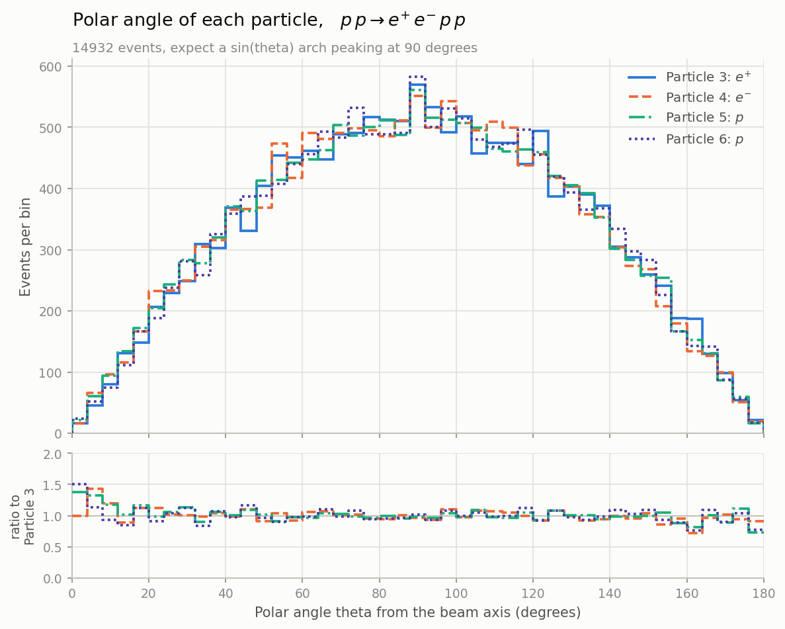
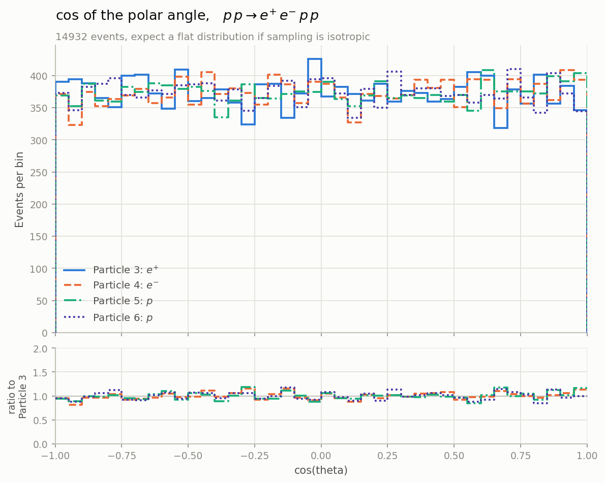

# LHC Simplified Particle Collision Simulator

A simplified Monte Carlo simulation of proton–proton collisions at the Large Hadron
Collider (LHC), written in Python. It "collides" two protons over and over,
invents a physically valid set of outgoing particles for each collision, filters
them through a simplified detector, and saves the survivors to a text file that
we then turn into histograms.

This README is written for someone who has **never seen the code or the physics
before**. It starts from the physics ideas, then shows how each idea turns into
code, and finally how to run everything.

The simulation now works in **full 3D**. Earlier versions kept everything in a
flat plane to make the maths easier, so wherever that move changed something
important, this README says so.


*Energy carried by each of the four particles in the process p p → e⁺ e⁻ p p,
over 14,932 events. Every figure in this project is drawn as an outline rather
than a filled histogram, so all the particles in a process can share one set of
axes. The panel underneath shows each curve divided by the first. The electron
and positron (particles 3 and 4) clearly drift towards higher energies than the
two protons (5 and 6), which is a real asymmetry in how we generate events — see
[section 7](#7-known-limitations-and-things-still-to-fix).*

---

## Table of contents

1. [The physics, from scratch](#1-the-physics-from-scratch)
2. [How the code mirrors the physics](#2-how-the-code-mirrors-the-physics)
3. [How to run it](#3-how-to-run-it) — including
   [where to change the settings](#34-where-to-change-the-settings)
4. [The output file explained](#4-the-output-file-explained)
5. [Making the plots](#5-making-the-plots)
6. [What the plots should look like](#6-what-the-plots-should-look-like)
7. [Known limitations and things still to fix](#7-known-limitations-and-things-still-to-fix)
8. [Project structure](#8-project-structure)
9. [License](#9-license)

---

## 1. The physics, from scratch

Read this section first. If you understand it, the code in section 2 will feel
like a straight translation of these ideas.

### 1.1 What is actually being simulated?

The LHC is a 27 km ring that accelerates two beams of **protons** in opposite
directions and smashes them head-on. Each beam carries **6.8 TeV** of energy, so
a head-on collision has a total energy of **13.6 TeV** — the real LHC "Run 3"
energy.

- **TeV** means tera-electronvolt, a unit of energy. Everything in this project
  is measured in TeV.
- A **proton** is not fundamental. It is a bag of smaller pieces (quarks and
  gluons, collectively "partons"). When two protons collide it is really one
  piece from each proton that interacts hard, while the leftovers carry on.

When the collision happens the energy is briefly concentrated into a tiny point
and then re-materialises as **new particles**. Which particles come out is random
and governed by probabilities.

### 1.2 What comes out of a collision? (the "final state")

The list of particles produced by one collision is called the **final state**.
We use a fixed menu of possible final states, each with a fixed probability:

| Probability | Final state                             | Particles |
|-------------|-----------------------------------------|-----------|
| 25%         | proton + proton                         | 2 |
| 22%         | photon + proton + proton                | 3 |
| 18%         | neutron + antineutron + proton + proton | 4 |
| 15%         | positron + electron + proton + proton   | 4 |
| 15%         | muon + antimuon + proton + proton       | 4 |
| 5%          | photon + photon + proton + proton       | 4 |

Most cases also produce "proton remnants", the leftovers of the original protons
that did not interact, alongside the interesting particles from the hard
collision.

The most physically interesting case is the **two-photon** one, because two
photons are how a **Higgs boson** reveals itself. We made it deliberately rare at
5%, just as a real Higgs signal is rare.

Notice that the menu only ever produces 2, 3, or 4 particles. That is what the
code calls the **2 to 2**, **2 to 3**, and **2 to 4** channels, and it is the
organising idea behind almost everything else in the project.

### 1.3 The two rules nature never breaks

Whatever comes out, two quantities must be **conserved**, meaning identical
before and after the collision:

1. **Energy.** The outgoing particles' energies must add up to the total we
   started with, **13.6 TeV**.
2. **Momentum.** Momentum is "quantity of motion" and it has a direction. The two
   protons come in exactly head-on with equal and opposite momentum, so the total
   momentum before the collision is **zero**. The outgoing particles' momenta must
   therefore also add up to **zero**, flying out in balanced directions like the
   fragments of an explosion.

Every event this simulation produces obeys both rules exactly. That is the single
most important correctness property of the whole program, and `simulation.py`
re-checks it on every event rather than taking it on trust.

### 1.4 Describing one particle: the four-vector

We place the collision at the origin with the **beam running along the `z`
axis**. The `x` and `y` axes point sideways, across the beam.

Each particle is then described by four numbers bundled together, called a
**four-vector**:

```
(E, px, py, pz)  =  (energy, momentum along x, along y, along z)
```

> **This is where 3D changed things.** The old 2D version had only `(E, px, pz)`,
> because everything was confined to one flat plane containing the beam. Adding
> `py` lets particles fly anywhere in space, which is what really happens.

Two derived quantities matter:

- **Momentum magnitude**, `|p| = sqrt(px² + py² + pz²)`, is how much motion the
  particle has if we ignore direction.
- **The direction it flew**, which in 3D needs *two* angles rather than one.

### 1.5 The two angles

In a plane, one angle is enough to say which way something went. In space you
need two, and they are worth getting straight because every angle plot in this
project uses them.

```
        θ = 0°   straight down the beam, forward
           ↑
           │ z  (beam axis)
           │        ╱ particle
           │      ╱
           │ θ  ╱
           │  ╱
   ────────●────────  θ = 90°   straight out the side
          ╱ collision
        ╱
      ╱
     ↓
  θ = 180°   straight back up the beam
```

- **Polar angle θ (theta)** is measured away from the beam axis. It answers "how
  far off the beam line did it go?" and runs from 0° to 180°. That range is
  enough, because 180° already points backwards.
- **Azimuthal angle φ (phi)** is the rotation *around* the beam. Picture looking
  straight down the beam pipe at a clock face: φ is the clock position. It runs
  from 0° to 360°.

In code these come straight out of the momentum components:

```python
theta = math.acos(pz / |p|)      # how much of the momentum lies along the beam
phi   = math.atan2(py, px)       # which way it points in the x-y plane
```

θ is the physically meaningful one. A real detector has a hole where the beam
pipe passes through, so particles at very small θ escape unseen. Nothing similar
happens in φ, because a detector is built symmetrically around the beam and no
clock position is special.

### 1.6 Why θ is not evenly spread

This surprises people, so it is worth its own heading.

We throw particles in **completely random directions**, with no preference
whatsoever. Even so, the θ histogram is *not* flat. It is an arch peaking at 90°.

The reason is geometry, not physics. Think of latitude lines on a globe. The band
between 89° and 90° latitude is a tiny cap at the pole. The band between 0° and
1°, the same one degree of angle, wraps the entire equator and has vastly more
area. A sphere simply has more room near its equator than near its poles, so more
particles land there.

The amount of room scales as **sin θ**, which is exactly the shape you see in the
θ plots. Taking the cosine cancels the effect precisely, so **cos θ comes out
flat**. That makes cos θ the honest test of whether our random directions really
are random, and it is why the project plots it alongside θ.

Here is the same data plotted both ways:

<table>
<tr>
<td width="50%"></td>
<td width="50%"></td>
</tr>
<tr>
<td><em>θ arches up towards 90°, because a sphere has more room near its equator.</em></td>
<td><em>cos θ is flat, which is what "no preferred direction" actually looks like.</em></td>
</tr>
</table>

Nothing about the physics differs between those two pictures. They are the same
particles, plotted through a different lens.

> If a θ histogram ever comes out flat, something is broken. If a cos θ histogram
> comes out anything other than flat, something is broken.

### 1.7 Mass, and the most important formula: invariant mass

Einstein's relation ties a particle's energy, momentum, and mass together:

```
E² = |p|² + m²           (in units where the speed of light is 1)
```

So a particle's **mass** can be recovered from its four-vector:

```
m = sqrt(E² − px² − py² − pz²)
```

This is the **invariant mass**. "Invariant" means every observer agrees on it no
matter how fast they are moving, which makes it the perfect tool for identifying
particles.

The magic trick is that you can compute the invariant mass of **several particles
added together**, treating them as a single object:

```
m(group) = sqrt( (ΣE)² − (Σpx)² − (Σpy)² − (Σpz)² )
```

**Why we care:** if two photons came from a decaying Higgs boson, the invariant
mass of those two photons always equals the **Higgs mass, 125 GeV (0.125 TeV)**.
Make a histogram of the two-photon invariant mass over many events and a Higgs
shows up as a bump at 125 GeV sitting on a smooth background. That is exactly how
the Higgs was found in 2012.

*This project does not simulate a Higgs signal, so no bump appears in our
diphoton plots. That is a deliberate scope decision rather than something
missing — see [section 7](#7-known-limitations-and-things-still-to-fix). The
invariant mass machinery is all here and works the same way it would for a real
search.*

### 1.8 How we build one event: split two at a time

Here is the idea ([report](docs/report.pdf) section 2.5.3) that lets us create any final state while
**guaranteeing** energy and momentum conservation.

Rather than trying to place 3 or 4 particles at once, we only ever split **one
thing into two**, because a two-body split is easy to make conservation-perfect:

> If a parent particle sits still and splits into two, the children must fly off
> in **exactly opposite directions** with **equal and opposite momentum**, and
> energy conservation fixes exactly how much energy each child gets.

To build a 4-particle final state, say two photons and two protons:

1. Pretend the two photons are secretly **one** made-up particle, call it `(34)`,
   and the two protons another, `(56)`. Each made-up particle gets an invariant
   mass that we pick at random.
2. Split the whole collision into `(34)` + `(56)`, one clean two-body split.
3. Split `(34)` into its two photons and `(56)` into its two protons, two more
   two-body splits.

There is one complication. When we split `(34)` we work in the frame where `(34)`
is standing still, but `(34)` is really **flying through the lab**. So we have to
**boost** its two children, a Lorentz transformation that accounts for that
motion. This is standard special relativity ([report](docs/report.pdf) section 2.5.4).

> **3D again.** The boost used to be a 3×3 matrix acting on `(E, px, pz)`. It is
> now the general 4×4 Lorentz boost acting on `(E, px, py, pz)`. Same idea, one
> more dimension.

A 3-particle final state works the same way with a single composite. A 2-particle
final state is one split with no boost needed at all.

The upshot is that every particle comes out **on-shell**, meaning its `E`, `p`,
and `m` are mutually consistent, and the whole event conserves energy and
momentum automatically.

### 1.9 The detector: what we can actually see

A real detector cannot see everything, so we model its blind spots with **cuts**.

**The cuts are not part of the generator.** `simulation.py` writes down every
collision it makes, unfiltered. The cuts are applied afterwards by `analysis.py`,
which reads its numbers from a plain text file, `analysis_card.txt`. You change
what the detector sees by editing that card — never by editing code.

That split matters for two reasons. Generating events is the slow part, so
keeping it separate lets you try a dozen different cuts against the same dataset
in seconds. And it mirrors how a real experiment works: the detector records
everything it can, and choosing the cuts is a decision the analyst makes later.

Four cuts are available. Each can be switched off independently, and a particle
must satisfy every cut that is switched on.

#### Cut 1 — pseudorapidity, `pseudo_rapidity_max`

**Pseudorapidity** is the polar angle θ rewritten in the units particle
physicists actually use:

```
η = −ln( tan(θ/2) )
```

It is not new physics, just a relabelling of section 1.5's polar angle. Small θ
(straight down the beam) gives large η; θ = 90° gives η = 0. The reason the field
prefers it is that differences in η are unchanged by boosts along the beam,
which makes it the natural coordinate at a hadron collider.

Our cut `|η| < 2.5` is the standard ATLAS/CMS inner-detector coverage. Converted
back to degrees it means:

```
9.385°  <  θ  <  170.615°
```

So it is precisely a **beam-pipe cut**. Anything closer to the beam than about
9° disappears down the hole the beam itself travels through, and no detector
element is there to catch it.

#### Cut 2 — transverse momentum, `transverse_momentum_min`

**Transverse momentum** is the part of the momentum pointing *across* the beam
rather than along it:

```
pT = sqrt(px² + py²) = |p| · sin θ
```

and because every outgoing particle here is massless (`E = |p|`), that is simply
`pT = E · sin θ`.

This is the cut that replaces a plain energy threshold, and it is a better one. A
detector measures pT, not total energy, and a very energetic particle skimming
along the beam is useless — its `sin θ` is tiny, so it deposits almost nothing
across the detector. The cut therefore scales with angle:

| Polar angle θ | Energy needed to pass `pT > 0.1 TeV` |
|---|---|
| 5° | 1.147 TeV |
| 9.4° | 0.612 TeV |
| 30° | 0.200 TeV |
| 90° | 0.100 TeV |

Note this cut **overlaps** with the pseudorapidity one. Because `pT = E·sin θ`,
a pT cut already suppresses particles near the beam pipe on its own. That is
normal, and real analyses apply both anyway.

#### Cut 3 — minimum energy, `min_energy`

The simplest cut of the four: drop any particle carrying less than a given
energy, because very soft particles are lost in detector noise. This is the cut
`transverse_momentum_min` improves on, since it ignores direction entirely, but
it is kept because it is easy to reason about.

#### Cut 4 — polar angle window, `theta_min_deg` and `theta_max_deg`

The beam-pipe cut written directly in degrees rather than in pseudorapidity.
Keep a particle only if `theta_min_deg < θ < theta_max_deg`. Setting `0` and
`180` accepts everything.

This is the same physical idea as cut 1 in friendlier units, so you would
normally use one or the other rather than both. `|η| < 2.5` is equivalent to a
window of `9.385°` to `170.615°`.

#### What the cuts cost you

Here is the professor's recommended pair — `pseudo_rapidity_max = 2.5` and
`transverse_momentum_min = 0.1` — applied to the shipped 100,000 event dataset,
keeping an event only if every one of its particles passes:

| Cut | Events surviving |
|---|---|
| η only | 96.3% |
| pT only | 95.7% |
| **Both together** | **92.6%** |

Per channel, the survival rates are 98.7% for 2 → 2, 94.9% for 2 → 3 and 88.8%
for 2 → 4. The 2 → 4 channel loses the most simply because it has four chances
to fail rather than two.

Notice that every cut acts on energy or on θ, and none touches φ. That is the
physically correct choice: the beam pipe is a hole along the beam axis, so it
removes a cone at small θ, not a wedge in φ, and a real detector is built
symmetrically around the beam.

> **The dataset in `collision_data/events.txt` is uncut**, which is exactly as
> intended — `simulation.py` never filters. Run `analysis.py` to apply the card's
> cuts to it. See [section 3.4](#34-where-to-change-the-settings).

---

## 2. How the code mirrors the physics

The project splits into three stages that run one after another. Each writes a
file the next one reads, and none of them imports the others, so you can re-run
any stage on its own.

```
   STAGE 1 — generate                STAGE 2 — cut               STAGE 3 — plot

   simulation.py                      analysis.py                 graph_*_steps.py
        │                                 │                            │
        │ uses utilities/kinematics.py    │ reads analysis_card.txt     │ use event_data.py
        ▼                                 ▼                            ▼
   collision_data/events.txt ───►  collision_data/events_analysed.txt ───►  plots/
        (everything, uncut)              (only what survives)         (73 figures)
```

Stage 2 is optional. The graphing scripts read `events.txt` by default, so you
can go straight from stage 1 to stage 3 if you want the unfiltered picture.

### 2.1 Stage 1, generating collisions

| File | Plays the role of | Responsible for |
|------|-------------------|-----------------|
| `utilities/kinematics.py` | the **physicist** | the physics: four-vectors, two-body splits, boosts, invariant mass (sections 1.4–1.8). Deals only in numbers, never particle names. |
| `simulation.py` | the **director** | running the experiment: choosing final states and writing the output (sections 1.2, 1.3). |

`simulation.py` applies **no cuts at all**. The only event it ever throws away is
one that fails the energy and momentum conservation check, which would mean a bug
rather than a detector limitation.

**`kinematics.py`** is organised in five numbered sections, in reading order:

1. **The four-vector.** `P4 = (E, px, py, pz)`, plus `mass(p4)` and
   `invariant_mass(*p4s)` — a direct translation of sections 1.4 and 1.7.
2. **The two building blocks.** `two_body_decay(parent_mass, m1, m2)` splits a
   parent-at-rest into two children; `boost(p4, parent_p4)` carries a child from
   its parent's rest frame into the lab; `decay_in_lab(...)` is a small helper
   that does "decay, then boost both children" so the generators below do not
   repeat themselves.
3. **`draw_composite_mass(low, high)`** randomly picks the invariant mass of a
   made-up composite like `(34)`.
4. **The generators**, one per final-state size, named after the [report](docs/report.pdf)'s cases:
   `two_to_two`, `two_to_three`, `two_to_four`. Each is just the building blocks
   arranged as described in section 1.8. Every *final* particle is treated as
   **massless**; only the intermediate composites carry mass.
5. **`generate_momenta(n_particles, total_energy)`** is the single entry point.
   Because every particle is massless it only needs to know *how many* there are.

`kinematics.py` never mentions "photon" or "proton". It only sees masses and
numbers, which keeps the physics reusable and testable on its own.

**`simulation.py`** reads top to bottom as five steps:

1. **`choose_final_state()`** rolls a random number and returns the list of
   particle **names** for this collision, from the menu in section 1.2.
2. **`make_event(names)`** is the bridge to the physics. It calls
   `kinematics.generate_momenta(...)`, works out θ and φ for each result, and
   packages everything into `Particle` objects carrying
   `(name, energy, px, py, pz, theta, phi)`.
3. **`is_conserved(event)`** re-checks that energy sums to 13.6 and momentum sums
   to zero. This is the only rejection the file makes.
4. **`write_event(...)`** appends one event to the output file.
5. **`run_simulation()` / `main()`** loop until enough events are logged, then
   print a short summary.

### 2.2 Stage 2, applying the cuts

| File | What it does |
|------|--------------|
| `analysis_card.txt` | The cut values, as plain text. **This is the file you edit.** |
| `analysis.py` | Reads the card, applies the cuts, prints a survival report, and writes the filtered dataset. |

`analysis.py` prints a table like this:

```
Cuts applied:
  |eta|        < 2.5   (theta in [9.385, 170.615] deg)
  pt          >= 0.1 TeV
  event kept if: every particle must pass

channel         events      kept    kept %    particles kept %
--------------------------------------------------------------
2 to 2           24985     24657     98.7%               98.7%
2 to 3           22182     21047     94.9%               98.1%
2 to 4           52833     46929     88.8%               96.7%
--------------------------------------------------------------
TOTAL           100000     92633     92.6%               97.3%
```

It then writes the survivors to `collision_data/events_analysed.txt` in exactly
the same format as `events.txt`, so the graphing scripts can read either one
without modification.

A misspelled setting in the card is reported as an error with its line number
rather than being ignored, because a cut that silently fails to apply is the
worst possible outcome.

### 2.3 Stage 3, plotting

| File | What it does |
|------|--------------|
| `event_data.py` | Reads an events file once and hands back tidy arrays, grouped by channel. |
| `step_plot.py` | Draws histograms as outlines instead of filled bars, so several can share one set of axes. |
| `graph_energy_steps.py` | Energy of every particle. |
| `graph_angle_steps.py` | θ, φ, cos θ, and pseudorapidity η of every particle, with a separate θ plot for each particle. |
| `graph_pt_steps.py` | Transverse momentum pT of every particle. |
| `graph_mass_steps.py` | Single-particle and pair invariant masses. |

All four make one set of figures **per process**, each in its own folder under
`plots/` — see [section 5](#5-making-the-plots).

`event_data.py` exists because of a lesson we learned the hard way. The graphing
scripts we used before the 3D move each carried their own copy of the file parser
with a **column number** hard-coded into it. When the output gained `Phi` and
`p_y`, those numbers silently pointed at the wrong columns. Nothing crashed; the
plots just quietly became wrong. Reading the file in one place, and naming
columns instead of numbering them, is what stops that happening again.

Everything in `analysis_tools/` works out its paths from its own location rather
than from the working directory, so the scripts behave identically whether you
run them from the project root, from inside `analysis_tools/`, or from the VS
Code Run button. Figures always land in `plots/` at the project root.

`step_plot.py` is a library, not a script. Running it directly does nothing at
all — it only acts when one of the three `graph_*` scripts imports it.

### 2.4 The data flow, end to end

```
 simulation.py                          utilities/kinematics.py
 ─────────────                           ───────────────────────
 choose_final_state()
   → ["photon","photon","proton","proton"]   (just names, no physics yet)
        │
   count them  → 4 particles
        │
   make_event()  ── generate_momenta(4, 13.6) ──►  pick generator (two_to_four)
                                                     split into composites,
                                                     decay each, boost
        ◄────────────  [P4, P4, P4, P4]  ────────────
        │
   work out θ and φ, wrap each P4 + name  →  [Particle × 4]
        │
   is_conserved? ✓   (no cuts here -- that is analysis.py's job)
        │
   write_event()  →  append to collision_data/events.txt
        │
   repeat until 100,000 events are logged
```

**In one sentence:** `simulation.py` decides *which* particles appear, while
`kinematics.py` produces the *actual energies and momenta*, obeying the
conservation laws by construction. Neither of them judges whether the detector
would have seen the result -- that is `analysis.py`.

---

## 3. How to run it

### 3.1 What you need

- **Python 3** (developed on 3.14).
- **numpy** and **matplotlib**, for the analysis scripts only. The simulation
  itself uses nothing outside the standard library.

The virtual environment is **not** part of the repository (`.venv/` is in
`.gitignore`), so after cloning, create your own and install the packages listed
in `requirements.txt` into it:

```powershell
python -m venv .venv
.\.venv\Scripts\Activate.ps1          # Windows PowerShell
pip install -r requirements.txt
```

On macOS or Linux the activate line is `source .venv/bin/activate` instead. The
project was developed against numpy 2.4 and matplotlib 3.10, but any recent
version of either should work.

> Some Python builds on Windows (MSYS2, for example) create the environment with
> a `bin/` folder instead of `Scripts/`. If `Scripts\Activate.ps1` does not
> exist, use `.\.venv\bin\Activate.ps1`.

In VS Code, check the interpreter shown in the bottom-right corner is the one in
`.venv`. If it is pointing at a system Python, numpy and matplotlib will not be
found.

### 3.2 Run the analysis and the plots

**`collision_data/events.txt` already contains 100,000 events**, so you can go
straight to the analysis and plots without generating anything. Start here:

```powershell
python analysis_tools\event_data.py       # ~2s — prints a summary, writes nothing
```

It prints each channel followed by a line per particle slot:

```
2 to 2: 24985 events
    slot 0 (particle 3): mean E =  6.8000 TeV   names = proton
    slot 1 (particle 4): mean E =  6.8000 TeV   names = proton
2 to 3: 22182 events
    slot 0 (particle 3): mean E =  4.5365 TeV   names = photon
    ...
2 to 4: 52833 events
    ...
```

That is a good first check. If the three event counts look right, the file parsed
cleanly and the rest will work.

**Next, apply the detector cuts:**

```powershell
python analysis.py                        # ~4s
```

This reads `analysis_card.txt`, prints how many events survived each channel, and
writes the survivors to `collision_data/events_analysed.txt`. Edit the card and
run it again to try a different set of cuts — you never have to regenerate the
collisions.

You can also keep several cards and pick one on the command line:

```powershell
python analysis.py tight_cuts.txt
```

**Finally, draw the figures.** Run any or all of:

```powershell
python analysis_tools\graph_energy_steps.py    # ~4s,   6 figures
python analysis_tools\graph_angle_steps.py     # ~13s, 45 figures
python analysis_tools\graph_pt_steps.py        # ~4s,   6 figures
python analysis_tools\graph_mass_steps.py      # ~6s,  16 figures
```

Each writes PNGs into a folder per process under `plots/`, and prints a table of
the same numbers it drew, so the values are available without opening an image.
The four are independent and can be run in any order, from any working
directory.

By default they plot the **full, uncut** dataset. To plot the filtered one
instead, change one line at the top of each script:

```python
DATA_FILE = PROJECT_ROOT / "collision_data" / "events.txt"           # before
DATA_FILE = PROJECT_ROOT / "collision_data" / "events_analysed.txt"  # after
```

### 3.3 Re-generate the collisions

Only needed if you want a different number of events, or if you have changed the
physics:

```powershell
python simulation.py             # ~5s
```

> **Careful.** This opens `collision_data/events.txt` in write mode and
> **overwrites it without asking**. Copy the file first if you want to compare
> before and after. It is also tracked in git at 48 MB, so re-running puts a very
> large diff in your working tree.

Afterwards, re-run `analysis.py` and the three graph scripts to refresh
everything downstream.

---

### 3.4 Where to change the settings

There are exactly **two places** you ever need to edit, and neither is buried in
the code:

| What you want to change | Where |
|---|---|
| **The detector cuts** | `analysis_card.txt` — a plain text file, no Python |
| **How many collisions to generate** | `simulation.py`, line 36 |

You never need to touch anything in `utilities/` or `analysis_tools/`.

---

#### Changing the cuts — edit `analysis_card.txt`

Open `analysis_card.txt` in the project root. It is plain text with one setting
per line and a block of explanation above each one. **Change the number to the
right of the `=` sign**, save, and re-run `python analysis.py`.

```
# analysis_card.txt

min_energy = 0.0                 <-- CHANGE THIS   (TeV; drop softer particles)

theta_min_deg = 0.0              <-- CHANGE THESE  (degrees; the beam-pipe window)
theta_max_deg = 180.0

pseudo_rapidity_max = 2.5        <-- CHANGE THIS   (|eta| limit; 'none' switches it off)

transverse_momentum_min = 0.1    <-- CHANGE THIS   (TeV; momentum across the beam)

require_all_particles = yes      <-- yes = whole event fails if any particle fails
write_filtered_file = yes        <-- yes = also save the surviving events
```

| Setting | Units | Switch it off with | To loosen it | To tighten it |
|---|---|---|---|---|
| `min_energy` | TeV | `0` or `none` | Lower it | Raise it — `1.0` keeps only hard particles |
| `theta_min_deg` / `theta_max_deg` | degrees | `0` and `180` | Widen the window | Narrow it — `30` to `150` keeps only central particles |
| `pseudo_rapidity_max` | — | `none` | Raise it — `5.0` accepts down to 0.77° | Lower it — `1.0` keeps only `40.4° < θ < 139.6°` |
| `transverse_momentum_min` | TeV | `0` or `none` | Lower it | Raise it — `0.5` keeps only hard, central particles |

All four are explained in [section 1.9](#19-the-detector-what-we-can-actually-see).
Every cut that is switched on has to be satisfied, so switching all four off
reproduces the full dataset exactly.

If you misspell a setting name or type something that is not a number,
`analysis.py` stops and tells you the line number rather than silently ignoring
it.

---

#### Changing the number of collisions — edit `simulation.py`

This is the one people look for most often. **Change the number on this line:**

```python
# simulation.py, line 36
TARGET_LOGGED_EVENTS = 100000    # stop once this many events have been written
#                      ^^^^^^
#                      CHANGE THIS
```

Since `simulation.py` applies no cuts, this is simply how many events end up in
the file. Rough guide:

| Value | Runtime | Output size | Good for |
|---|---|---|---|
| `1000` | under a second | ~0.5 MB | a quick check that things work |
| `10000` | ~1 second | ~5 MB | rough-shaped histograms |
| `100000` | ~5 seconds | ~48 MB | the current dataset, smooth histograms |
| `1000000` | ~1 minute | ~480 MB | very smooth, but too big for git |

#### Collision energy and output location

```python
# simulation.py, lines 35 and 37
TOTAL_ENERGY = 13.6              # TeV, the LHC collision energy
OUTPUT_FILE  = Path(__file__).resolve().parent / "collision_data" / "events.txt"
```

`TOTAL_ENERGY` is the real LHC Run 3 figure; change it only if you are
deliberately simulating a different machine. `OUTPUT_FILE` is built from the
script's own location, so it lands in `collision_data/` no matter where you run
the script from — change the filename part if you want to keep several datasets
side by side rather than overwriting.

#### Random seed

```python
# simulation.py, a few lines below the settings above
SEED = 2026
```

With a number here, every run of `simulation.py` produces **exactly the same
events**, so anyone with the code can regenerate your dataset byte for byte. One
seed covers the whole chain, because `kinematics.py` draws from the same random
number generator. Change the number to get a different but still reproducible
sample, or set `SEED = None` for a fresh, unrepeatable one each run.

The dataset currently in `collision_data/` was generated before this setting
existed, so it is the one exception — see
[section 7](#7-known-limitations-and-things-still-to-fix).

> **After editing the card**, just re-run `python analysis.py` — the collisions
> do not need regenerating. **After editing `simulation.py`**, re-run
> `python simulation.py` first, then `analysis.py`, then the graph scripts.

---

## 4. The output file explained

The project produces exactly **two event files**, both in `collision_data/` and
both in the format described below:

| File | Written by | Contents |
|---|---|---|
| `events.txt` | `simulation.py` | Every generated collision, with no cuts applied |
| `events_analysed.txt` | `analysis.py` | Only the events that pass the cuts in `analysis_card.txt` |

`collision_data/events.txt` holds one block per accepted event:

```
___EVENT_ID: 1___
N_Particles: 2
Particle       Energy(TeV)    Theta(deg)     Phi(deg)       p_x(TeV)       p_y(TeV)       p_z(TeV)
proton         6.800000       66.421353      79.170650      1.170949       6.121291       2.720051
proton         6.800000       113.578647     259.170650     -1.170949      -6.121291      -2.720051

___EVENT_ID: 2___
N_Particles: 4
...
```

- `___EVENT_ID: n___` is the event number.
- `N_Particles` is how many particles this event has: 2, 3, or 4.
- Then one row per particle giving its **name**, **energy** in TeV, the two
  **angles** in degrees, and the three **momentum components** in TeV.

You can sanity-check any event by hand. The energies add up to 13.6, and the
`p_x`, `p_y`, and `p_z` columns each add up to about zero.

> **The row layout changed when we moved to 3D.** It used to be
> `name, Energy, Angle(rad), p_x, p_z` — five columns with the angle in radians.
> It is now seven columns with both angles in degrees. Anything written against
> the old five-column layout needs updating before it will read this file
> correctly.

One practical consequence worth knowing: values are written with **six decimal
places**. At 13.6 TeV that rounding works out to a few GeV of uncertainty once it
passes through `m = sqrt(E² − p²)`, which sets a floor on how sharp any
reconstructed mass peak in this file can be.

---

## 5. Making the plots

All three analysis scripts draw histograms **as outlines** rather than filled
bars. A filled histogram hides whatever is behind it, so you can only look at one
particle at a time — which is why the old scripts wrote a separate image per
particle and you had to flick between them. Drawing just the line along the tops
of the bars lets every particle in a channel share one set of axes.

Each figure also carries a **ratio panel** underneath, showing each curve divided
by the first one. A line sitting flat on 1.0 means those two particles have the
same shape.

### One folder per process

Every figure is made **per process** — one specific final state such as
p p → e⁺ e⁻ p p — and the process is written in the title of the figure. That
matters because the 2 → 4 channel holds four different processes. A figure of
"the 2 → 4 channel" would be putting muons, electrons, neutrons and photons on
the same curve, so we never draw one.

Each process gets its own folder inside `plots/`:

| Folder | Process | Events |
|---|---|---|
| `plots/pp_to_p_p/` | p p → p p | 24,985 |
| `plots/pp_to_gamma_p_p/` | p p → γ p p | 22,182 |
| `plots/pp_to_n_nbar_p_p/` | p p → n n̄ p p | 17,900 |
| `plots/pp_to_muminus_muplus_p_p/` | p p → μ⁻ μ⁺ p p | 14,986 |
| `plots/pp_to_eplus_eminus_p_p/` | p p → e⁺ e⁻ p p | 14,932 |
| `plots/pp_to_gamma_gamma_p_p/` | p p → γ γ p p | 5,015 |

Inside each folder you will find the same set of files:

| File | Made by | What it shows |
|---|---|---|
| `energy.png` | `graph_energy_steps.py` | Energy of every particle |
| `theta.png` | `graph_angle_steps.py` | Polar angle θ, every particle compared on one plot |
| `theta_particle3.png`, `theta_particle4.png`, … | `graph_angle_steps.py` | Polar angle θ, one particle per plot |
| `phi.png` | `graph_angle_steps.py` | Azimuthal angle φ |
| `costheta.png` | `graph_angle_steps.py` | cos θ |
| `eta.png` | `graph_angle_steps.py` | Pseudorapidity η, with the \|η\| = 2.5 acceptance marked |
| `pt.png` | `graph_pt_steps.py` | Transverse momentum pT |
| `mass_single.png` | `graph_mass_steps.py` | Mass of each single particle (a precision check) |
| `mass_pairs.png` | `graph_mass_steps.py` | Invariant mass of every pair (2 → 2 and 2 → 3 processes) |
| `mass_pairs_composites.png` | `graph_mass_steps.py` | The two pairs that really were composites (2 → 4 processes) |
| `mass_pairs_crossed.png` | `graph_mass_steps.py` | The four pairs that were not (2 → 4 processes) |

So a 2 → 4 process gets **five θ figures**: one for each of its four particles
on its own, plus one comparing all four. A 2 → 3 process gets four, and a 2 → 2
process gets three. Altogether the four scripts write **73 figures**.

The diphoton mass — the plot where a Higgs boson would show up as a bump — is
`plots/pp_to_gamma_gamma_p_p/mass_pairs_composites.png`, where pair 34 is the
two photons.

### Transverse momentum and pseudorapidity

These are the two quantities a real LHC analysis lives on, and both are
explained in [section 1.9](#19-the-detector-what-we-can-actually-see). The pT
figure for the simplest process makes a nice example of why they are worth
plotting:


*A Jacobian peak. In p p → p p both protons carry exactly 6.8 TeV, so
pT = 6.8 · sin θ. Near θ = 90° the sine is almost flat, so a wide range of
angles all pile up at nearly the same pT, and the distribution climbs to a sharp
edge at 6.8 TeV. Real experiments use exactly this edge to measure the mass of
the W boson. The two curves lie exactly on top of each other because two
particles flying back to back always share the same pT.*

The η figures should peak at zero and fall away symmetrically. That is the same
isotropic distribution as the flat cos θ plot, just written in different units:
because cos θ = tanh η, a flat cos θ becomes a `1/cosh²η` shape in η. The dashed
lines mark |η| = 2.5, the standard detector acceptance, so you can see at a
glance how much of each distribution a real detector would lose.

### A note on "the mass of each particle"

`kinematics.py` treats every outgoing particle as massless, so a single
particle's mass is zero by construction in every channel. Plotting it tells you
nothing about physics — but we plot it anyway, because it tells you something
useful about the data: whatever width that spike has is pure numerical noise, and
it is the sharpest any other mass peak in the file could possibly be.

The masses that actually carry information belong to **groups** of particles. Two
massless photons flying apart have a real, heavy combined mass. That is what the
composites of section 1.8 are, and what a real detector reconstructs when hunting
a Higgs. So the rest of `graph_mass_steps.py` plots the invariant mass of every
pair.


*Why pairing matters. In p p → γ p p, the two protons (particles 4 and 5)
genuinely came out of one composite, so the mass of pair 45 is flat — it is
simply the distribution we drew from. Pairs 34 and 35 each combine the photon
with a proton, were never a single object, and so give the broad hump instead. A
real analysis faces exactly this problem: the interesting pairing sits on top of
a background of wrong pairings, and telling them apart is the whole game.*

---

## 6. What the plots should look like

The useful thing about these distributions is that most of them have a shape you
can check against, which makes them a test of the simulation and not just a
picture of it.

| Figure | Expected shape | What it tells you |
|---|---|---|
| `costheta.png` | **Flat** | The direct test that our random directions are genuinely isotropic. Check this one first. |
| `theta.png`, `theta_particle*.png` | **sin θ arch** peaking at 90° | Section 1.6. Flat here would mean the 3D sampling is broken. |
| `phi.png` | **Flat** | No preferred direction around the beam. |
| `eta.png` | **Peak at 0**, falling as `1/cosh²η` | The same isotropy as cos θ, in the units detectors use. |
| `pt.png` in `pp_to_p_p` | **Jacobian peak**, a sharp edge at 6.8 TeV | Both protons have exactly 6.8 TeV and pT = E sin θ. |
| `pt.png` elsewhere | A broad hump below 6.8 TeV | The energies are spread out, so the edge is smeared. |
| `energy.png` in `pp_to_p_p` | A single spike at 6.8 TeV | With two massless particles and nothing else, conservation leaves no freedom at all. Both curves land on top of each other. |
| `energy.png` in the 2 → 4 folders | Particles 3 and 4 rising, 5 and 6 falling | The generator asymmetry described in section 7. |
| `mass_single.png` | A spike at zero | Every particle is massless, so the width is file rounding, not physics. |
| `mass_pairs.png` in `pp_to_gamma_p_p` | Pair 45 **flat**, pairs 34 and 35 humped | Pair 45 really was a composite, so its mass is the flat distribution we drew. The other two were never a single object, so they show the combinatorial background shape. |
| `mass_pairs_composites.png` | Pair 34 flat, Pair 56 falling away | The clearest view of the generator asymmetry. |

Every energy and pT axis stops at **6.8 TeV**, half the collision energy. That
is not an arbitrary cut-off: a massless particle can never carry more than half
the total, because the most it can do is recoil against everything else.

In the ratio panels, bins where the first curve holds fewer than 10 events are
left blank. A ratio of 2 events to 1 is pure noise, and drawing it would make the
thinly populated tails of every distribution look broken.

---

## 7. Known limitations and things still to fix

These are honest caveats rather than bugs that break the run.

1. **Every particle is treated as massless.** A deliberate simplification: final
   particles get no rest mass, so the `MASS` table in `simulation.py` is kept for
   reference only. It is a good approximation because all these masses are tiny
   next to 13.6 TeV, but it does mean a reconstructed proton comes out at ~0
   rather than its real 0.938 GeV. The intermediate composites still carry mass,
   and that part is essential and unaffected.

2. **No Higgs signal, by design.** The two-photon invariant mass is a plain
   random spread with no 125 GeV peak. Simulating a realistic Higgs signal is
   outside the scope of this project, so we do not attempt it. The diphoton mass
   plot is still worth having, because it shows exactly where such a signal would
   be looked for.

3. **Energy sharing is random rather than physical.** Composite masses are drawn
   uniformly, not from real particle-physics probabilities (matrix elements), so
   the distributions are illustrative and not predictive.

4. **The 2 to 4 channel is lopsided.** We draw `m34` uniformly across the whole
   range, then draw `m56` from whatever is left over. The second window is
   therefore smaller on average, so the `(56)` composite is systematically
   lighter and its particles systematically softer. Measured over 52,833 events,
   particles 3 and 4 average 4.17 TeV while particles 5 and 6 average only 2.65
   TeV, when by symmetry they ought to match. Fixing it means drawing both
   masses jointly instead of one after the other.

5. **Six decimal places limits mass resolution.** As noted in section 4, the
   output format caps reconstructed invariant mass precision at a few GeV. That
   is fine for TeV-scale composites but would matter for a 125 GeV peak.

6. **The figures are drawn from the uncut dataset.** `simulation.py` applies no
   cuts by design, so `collision_data/events.txt` and everything in `plots/` is
   the full sample. Running `analysis.py` with the card's default cuts would drop
   roughly 7% of events. Everything is consistent as it stands — just be aware
   the plots show the unfiltered picture unless you point the graph scripts at
   `events_analysed.txt`.

7. **`collision_data/events.txt` is 48 MB and tracked in git.** Convenient, since the plots can
   be reproduced without re-running anything, but it makes the repository heavy.

8. **The shipped dataset predates the random seed.** `simulation.py` now has a
   `SEED` setting, so any dataset generated from here on can be reproduced
   exactly. The `events.txt` in `collision_data/` was generated before that
   setting existed, so that particular file cannot be. Re-running
   `python simulation.py` would replace it with a reproducible one, at the cost
   of every event count and figure in this README changing slightly.

9. **No error bars.** The histograms and ratio panels show counts only, without
   their statistical uncertainty (√N per bin). Bear that in mind when reading the
   smaller processes: p p → γ γ p p has only 5,015 events, so bin-to-bin wiggles
   of 10–20% there are ordinary noise rather than physics.

---

## 8. Project structure

The three stages of section 2 each have their own entry point at the top level,
and the supporting code sits in folders beside them. Data files pass between the
stages through `collision_data/`.

```
LHC Simulation/
├── simulation.py               STAGE 1 — generate events, no cuts applied
├── analysis.py                 STAGE 2 — apply the cuts
├── analysis_card.txt           >>> THE FILE YOU EDIT to change the cuts <<<
│
├── utilities/
│   └── kinematics.py           the physics engine
│
├── analysis_tools/             STAGE 3 — the plotting code
│   ├── event_data.py           reads an events file into tidy arrays
│   ├── step_plot.py            outline-histogram drawing (a library, not a script)
│   ├── graph_energy_steps.py   ┐
│   ├── graph_angle_steps.py    │
│   ├── graph_pt_steps.py       ├─ the four graphing scripts
│   └── graph_mass_steps.py     ┘
│
├── collision_data/
│   ├── events.txt              100,000 events, the full uncut dataset
│   └── events_analysed.txt     only the events that survived the cuts
│                               (written by analysis.py; not tracked in git)
│
├── plots/                      73 figures, one folder per process
│   ├── pp_to_p_p/
│   ├── pp_to_gamma_p_p/
│   ├── pp_to_n_nbar_p_p/
│   ├── pp_to_muminus_muplus_p_p/
│   ├── pp_to_eplus_eminus_p_p/
│   └── pp_to_gamma_gamma_p_p/
│
├── docs/
│   └── report.pdf              the written report with the full derivations
│
├── requirements.txt            the Python packages to install
└── COPYING                     the license (GNU GPL v3)
```

Every script works out these paths from its own location rather than from the
working directory, so they behave the same wherever you launch them from.

### What each file does

| File | What it is |
|------|------------|
| `utilities/kinematics.py` | The physics engine: four-vectors, two-body decays, Lorentz boosts, invariant mass. Knows nothing about particle names. |
| `simulation.py` | Stage 1. Chooses final states, generates their kinematics, writes `collision_data/events.txt`. Applies no cuts. |
| `analysis.py` | Stage 2. Reads `analysis_card.txt`, applies the cuts, reports what survived, writes `collision_data/events_analysed.txt`. |
| `analysis_card.txt` | The cut values, in plain text. **The only file you edit to change what the detector sees.** |
| `analysis_tools/event_data.py` | Parses `events.txt` and groups events by channel. Run it on its own for a quick summary of the dataset. |
| `analysis_tools/step_plot.py` | Turns bin counts into outline curves and lays out the figure, including the ratio panel. Imported by the four scripts below, and does nothing if you run it directly. |
| `analysis_tools/graph_energy_steps.py` | Energy of each particle, one figure per process. |
| `analysis_tools/graph_angle_steps.py` | θ (compared, and one plot per particle), φ, cos θ, and η of each particle, per process. |
| `analysis_tools/graph_pt_steps.py` | Transverse momentum of each particle, per process. |
| `analysis_tools/graph_mass_steps.py` | Single-particle mass and pair invariant masses, per process, including the diphoton mass. |
| `collision_data/events.txt` | The current dataset: 100,000 events in the 3D seven-column format, with no cuts applied. |
| `collision_data/events_analysed.txt` | The subset that survived the cuts, written by `analysis.py` in the same format. Regenerate it rather than committing it — it is in `.gitignore`. |
| `docs/report.pdf` | The written project report. The code and this README cite its sections and equations. |
| `requirements.txt` | The Python packages the analysis needs. Install with `pip install -r requirements.txt`. |
| `COPYING` | The license, the GNU General Public License version 3. See [section 9](#9-license). |

---

## 9. License

This project is released under the **GNU General Public License, version 3**.
The full text is in [`COPYING`](COPYING).

In short, you are free to use, study, share and modify the code. If you
distribute a modified version, you must release it under the same license and
make its source code available too.

---

*Phenikaa University Research Lab — computational physics simulation of
high-energy proton collisions.*
